# Final Project – Machine Learning Applications  
## Julien VOLLET

## Introduction

The automatic analysis of textual documents has become a key issue in many domains such as information monitoring, personalized recommendation, and sentiment analysis. Within this context, the project we conducted falls under the "Applications of Machine Learning" course, with the objective of implementing a complete pipeline for processing textual data from preprocessing to interactive visualization of the results.

We chose to work with a dataset from TripAdvisor, focused on restaurants located in France. This dataset includes descriptive textual information associated with each establishment (such as keywords, types of cuisine, atmosphere, etc.), as well as numerical variables like average rating and number of reviews.

The project is structured around several successive tasks:

- **Task 1**: Text preprocessing (`keywords`) and vectorization using various techniques (TF-IDF, Word2Vec, etc.), as well as topic modeling with LDA.
- **Task 2.1**: Building a supervised classification model to predict whether a restaurant is highly rated based on its textual descriptors.
- **Task 3**: Developing an interactive dashboard with Dash to explore automatically extracted topics and their geographic distribution.

Throughout this project, we applied key concepts covered in the course: text cleaning, vectorization, feature selection, supervised and unsupervised modeling, dynamic visualization, and rigorous performance evaluation. This report outlines the entire process, including the technical and methodological decisions made along the way.

## 1. Task 1 – Natural Language Processing, Vectorization, and Topic Modeling

### 1.1 Dataset Description

The dataset used comes from a public extract of the TripAdvisor website, containing information on over 10,000 restaurants across Europe. To align with the scope of our project, we filtered the data to include only restaurants located in **France**.

The variables retained after preprocessing are:

- `restaurant_name`: name of the restaurant  
- `city`, `address`: location  
- `latitude`, `longitude`: geographic coordinates  
- `cuisines`, `special_diets`, `features`, `atmosphere`: categorical text features  
- `avg_rating`: average rating (0 to 5)  
- `total_reviews_count`: number of reviews  
- `keywords`: qualitative keywords associated with the restaurant  

We removed all entries with missing essential information (e.g., missing name, location, rating, or keywords), as well as duplicate records. After this cleaning process, the final dataset contains approximately **X unique restaurants** across **Y French cities**. The `keywords` column — a free-text field — was used as the primary input for vectorization and thematic analysis.

**Example:**  
A sample set of keywords for a restaurant:
> `["vegetarian friendly", "romantic", "gluten free options", "terrace", "wine bar"]`

We observed a high level of semantic diversity in these descriptors, which justified the need for a robust NLP preprocessing pipeline.

### 1.2 Text Preprocessing Pipeline

Preprocessing focused on the `keywords` column, which contains textual strings representing qualitative attributes. The goal of the cleaning process was to normalize and simplify this data prior to vectorization.

The following steps were applied:

- **Lowercasing**: to standardize terms  
- **Punctuation removal**: to clean out special characters  
- **Custom stopword removal**: filtering out high-frequency, low-information words like "the", "in", "with"  
- **Tokenization**: splitting keywords into tokens using a simple `split()` method

**Example (before/after):**

| Original Text                                     | After Cleaning                      |
|--------------------------------------------------|-------------------------------------|
| `"Gluten Free Options, Good for Groups, Cozy"`   | `"gluten free options good groups cozy"` |

Each restaurant is thus represented by a list of **short, specific tokens**, which serve as the basis for text vectorization.

We also analyzed the distribution of the number of tokens (cleaned keywords) per restaurant to validate the consistency and density of available textual information.

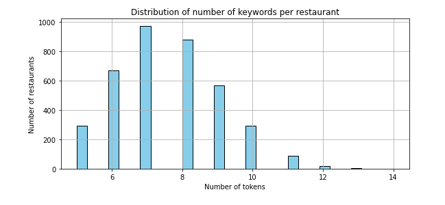

> *Figure: Histogram showing the number of keywords (tokens) per restaurant after cleaning. Most establishments have between 6 and 9 tokens.*

This distribution reveals a **clear concentration around 6 to 9 keywords per restaurant**, suggesting a certain standardization in how establishments are described. Very few restaurants have fewer than 5 or more than 10, indicating a **reasonably consistent information density** across samples.

This regularity is an advantage for machine learning: it ensures that most entries have a sufficient volume of descriptors to allow stable vectorization and reliable interpretation. It also supports our choice of using methods such as TF-IDF or LDA, which require a minimal lexical presence to produce meaningful results.

#### Decision to **omit lemmatization**

We deliberately chose not to apply lemmatization for the following reasons:

- The `keywords` are **fixed phrases** (e.g., "wine bar", "family friendly"), and altering them could distort their meaning.
- Morphological variants are **rare** in this context (there are no "run/running/ran"-type issues).
- Seemingly similar expressions like `"drinks available"` and `"drink bar"` have distinct meanings — lemmatization could **merge non-equivalent entities**.

Therefore, we opted for a **minimalist but semantically safe** approach that preserves the original richness of the keywords.

### 1.3 Explored Vectorization Methods

To convert textual data into numerical representations usable by machine learning algorithms, we experimented with several vectorization techniques tailored to the short, specialized text format of the `keywords`.

#### TF-IDF (Term Frequency – Inverse Document Frequency)

TF-IDF is a weighted method that assigns each word an importance score proportional to its frequency in a given document, and inversely proportional to its frequency across the entire corpus. In other words, words that are specific to a single restaurant are emphasized more than generic, overused terms. We used Scikit-learn’s `TfidfVectorizer`, which generates a high-dimensional sparse matrix (~5000 unique tokens). This method proved to be fast, stable, and well-suited to our context as it requires no prior training and maintains strong discriminative power.

#### Bag of Words (BoW)

The Bag of Words model is based on a simple principle: counting how many times each word appears in a document, without considering word order or context. Implemented with `CountVectorizer`, it is very fast but often too simplistic. It does not differentiate between relevant frequent words and uninformative ones, and its representations can be noisy if the vocabulary is too generic. That said, BoW can still be useful for basic models such as Naive Bayes.

#### Word2Vec

Word2Vec is a word embedding technique developed by Google that encodes each word as a dense vector, learned from the context in which it appears. In our project, we trained a Word2Vec model using Gensim. Each word is represented by a 100-dimensional dense vector, and a document is represented by the average of its word vectors. While semantically richer, this method requires prior training and becomes less effective when the corpus is small or lacks diversity, which is somewhat the case here.

#### Doc2Vec

Doc2Vec extends Word2Vec by learning a dense vector that represents the entire document, in addition to the individual word vectors. This allows it to capture the global structure of a text. Each restaurant was treated as a `TaggedDocument`. Although Doc2Vec is better suited for long or complex texts, in our case the performance gains did not justify the additional computational cost and complexity.

### 1.4 Topic Modeling with LDA

We explored the automatic detection of **latent topics** in the documents using the **Latent Dirichlet Allocation (LDA)** algorithm.

#### 1.4.1 LDA with Gensim

- Creation of a dictionary and a bag-of-words corpus.
- Training of multiple LDA models with **2 to 20 topics**.
- Evaluation using the **`c_v` coherence score**.
- The optimal score was reached at **K = X** topics.

**Graph:** Coherence score as a function of the number of topics

#### 1.4.2 LDA with Scikit-learn

We also implemented an LDA version using Scikit-learn. The `keywords` were vectorized using `CountVectorizer`, then a `LatentDirichletAllocation` model was trained with **K = 6** topics, determined as optimal after experimentation. Each restaurant was associated with a **dominant topic**, based on the generated probability distribution.

For each topic, we extracted the **10 most representative keywords** and identified a **general interpretable theme**:

| Topic | General Theme                   | Top Keywords                                                     |
|-------|----------------------------------|------------------------------------------------------------------|
| 0     | **Wine and Romantic Atmosphere** | `"wine", "romantic", "cozy", "fine dining", "bar", "terrace"`   |
| 1     | **Fast Food / Urban Dining**     | `"cheap", "fast", "burger", "takeaway", "quick", "snack"`       |
| 2     | **Healthy Cuisine and Diets**    | `"vegan", "gluten", "healthy", "fresh", "vegetarian", "organic"`|
| 3     | **Family and Groups**            | `"family", "kids", "friendly", "casual", "group", "homey"`      |
| 4     | **Local and Gourmet Cuisine**    | `"gourmet", "chef", "local", "authentic", "seasonal", "refined"`|
| 5     | **International / Bar Ambiance** | `"cocktails", "music", "dance", "international", "nightlife", "lounge"` |

---

These themes allow for interpretation of the semantics behind each automatically identified segment. They reflect distinct types of establishments — from traditional gourmet restaurants to fast food places, lounge bars, and family dining venues.

> **Why did we choose 6 topics?**

After testing various values for K (number of topics), we combined two complementary approaches:
- A **quantitative evaluation** using the `c_v` coherence score, providing a first indicator of thematic grouping quality.
- A **manual qualitative analysis**, inspecting dominant keywords and identifying redundancy between topics.

#### Coherence Curve (`c_v`) vs. Number of Topics

To visualize how coherence evolved with topic count, we plotted the following curve:

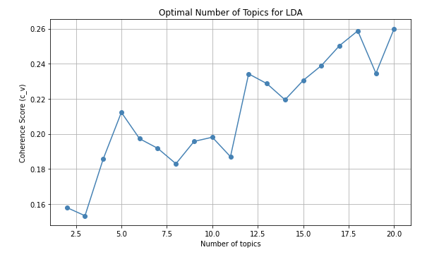

> *Figure: `c_v` coherence score depending on the number of topics (K). The point K=6 corresponds to the chosen model.*

The curve shows a **general upward trend** in coherence as the number of topics increases, but the progression is **not linear**. Several local peaks appear (notably at K=5, K=12, and K=17), while intermediate values show **temporary drops in coherence**. This suggests that increasing model complexity doesn't always yield better thematic groupings.

Therefore, we complemented the automatic evaluation with a **manual review** of the generated topics. Upon exploring topics across different K values, we found that beyond **6 topics**, **semantic redundancy** often occurred (e.g., two topics related to gourmet food or wine), making interpretation less clear.

To ensure distinct and interpretable themes, we used **ChatGPT** to help interpret the top keywords for each topic. At K=6, we observed a **clear thematic structure**, with well-differentiated segments aligned with real-world restaurant profiles (gourmet, family, fast food, bar, healthy, etc.).

This choice offered the right balance of **readability**, **interpretability**, and **thematic richness**, while avoiding the cognitive overload of too many topics. These insights were integrated into our **interactive dashboard (Task 3)**, allowing users to dynamically explore identified themes and their geographic distribution across France.

## 2. Task 2.1 – Supervised Classification

### 2.1 Task Objective

The objective of this task was to build a classification model capable of predicting whether a restaurant is **well-rated or not** based on its textual descriptors (`keywords`). This was framed as a **binary classification problem** using the `avg_rating` variable.

The target variable (`target`) was defined as follows:
- **Class 1 (positive)**: if `avg_rating >= 4.0`  
- **Class 0 (negative)**: if `avg_rating < 4.0`

This setup reflects a realistic use case: automatically recommending or filtering quality restaurants based on their descriptive profiles.

### 2.2 Methodology

We followed a classic supervised learning pipeline:

1. **Data Preparation**
   - Text was vectorized using four methods: TF-IDF, BoW, Word2Vec, and Doc2Vec
   - Dimensionality reduction using `SelectKBest(chi2)` or `PCA`, depending on the method
   - Normalization handled automatically by the models

2. **Train/Test Split**
   - Used `train_test_split` with an 80% / 20% ratio
   - `random_state=42` for reproducibility
   - Stratified by the target variable to maintain class balance

3. **Evaluation Metrics**
   - Accuracy, F1-score (macro and per class)
   - Confusion matrix
   - Area Under the ROC Curve (AUC)

### 2.3 Models Tested

We tested several classification algorithms, covering a range of approaches (linear, probabilistic, non-linear, neural networks) to identify those best suited for our binary prediction task.

**Logistic Regression** was our baseline: simple, linear, and interpretable. It performed well with sparse vectors like TF-IDF, but its limited capacity to model complex relationships can hinder performance with less linearly separable data.

**Random Forest** showed strong robustness: by combining multiple decision trees, it naturally captures interactions between features, even noisy ones. It handles unnormalized data well and performed especially well with dense vectors (Word2Vec). However, it is slower to train, more memory-intensive, and harder to interpret.

We also tested a **Gradient Boosting classifier**, known for its strong performance on structured datasets. It yielded good results but required **longer training times**, especially with high-dimensional text features.

**LinearSVC** (a linear Support Vector Classifier) emerged as one of the best models for TF-IDF vectors. Highly effective in high dimensions, it maximizes class separation margins, improving generalization. It's fast, robust, and less sensitive to outliers than other linear models. Its main drawback is that it does not output probability scores, which may limit its use in applications requiring calibrated outputs.

**Naive Bayes**, quick and easy to train, performed competitively with BoW and TF-IDF. However, its assumption of feature independence is too strong, and performance drops significantly with dense vectors or correlated terms.

**K-Nearest Neighbors (KNN)** offers an intuitive approach: a sample is classified based on its closest neighbors. It works well with compact vectors like Word2Vec, but inference is slow (due to real-time distance calculations) and it's sensitive to noise and class imbalance.

Finally, the **Multi-Layer Perceptron (MLP)** provides the most expressive solution, capable of learning complex non-linear relationships. It performed very well with Word2Vec and Doc2Vec, but requires careful hyperparameter tuning, long training times, and is more prone to overfitting.

In summary, each model presents trade-offs between **raw performance**, **speed**, **complexity**, and **interpretability**. Our evaluation highlighted **LinearSVC** and **Random Forest** as the most suitable for our use case, depending on the vectorization technique employed.

### 2.4 Dimensionality Reduction

To improve the efficiency and performance of our classification models, we applied dimensionality reduction techniques tailored to the type of vector representation used.

For sparse vectors such as TF-IDF and Bag-of-Words, we used **supervised feature selection** with `SelectKBest` based on the chi-squared (`χ²`) statistical test. This method evaluates the relevance of each feature with respect to the target variable, allowing us to retain only the most informative ones. We selected the top **300 features**, which significantly helped to **reduce overfitting** and **decrease training time**. This selection ensures that the classifier focuses on the most discriminative tokens while discarding noisy or redundant ones.

For dense vector representations like Word2Vec and Doc2Vec, we employed **unsupervised dimensionality reduction** using Principal Component Analysis (PCA). We reduced each document vector to its top **50 principal components**, capturing the most meaningful variance in the data. PCA allowed us to **extract latent semantic structure** from the original embeddings, compressing the information while preserving essential patterns. This not only accelerated the training of downstream models but also improved robustness by eliminating minor variations and noise.

Overall, dimensionality reduction played a key role in optimizing our pipeline, making it both computationally efficient and less prone to overfitting — especially important given the high dimensionality of textual data.

### 2.5 Comparative Results

### 2.5.1 Results and Model Comparison (TF-IDF)

We evaluated every combination of **[vectorization method + model]**. Below, we focus on the results obtained using **TF-IDF vectorization**, which overall proved to be the most effective technique.

####  Overall Performance (TF-IDF)

| Model                | Accuracy | F1_class_0 | F1_macro | AUC     |
|----------------------|----------|------------|----------|---------|
| **Linear SVC**       | 0.834    | **0.370**  | **0.637**| —       |
| Logistic Regression  | 0.801    | 0.329      | 0.606    | 0.759   |
| MLP (Neural Net)     | 0.884    | 0.241      | 0.589    | 0.640   |
| Random Forest        | 0.879    | 0.116      | 0.525    | 0.598   |
| Gradient Boosting    | 0.893    | 0.069      | 0.506    | 0.667   |
| KNN                  | 0.889    | 0.045      | 0.493    | 0.587   |
| **Naive Bayes**      | **0.897**| 0.000      | 0.473    | **0.807**|

> *Table: Performance of classification models trained on TF-IDF vectors. The emphasis is placed on the F1-score for class 0, which is crucial for detecting poorly rated restaurants.*

---

#### ROC Curve  TF-IDF

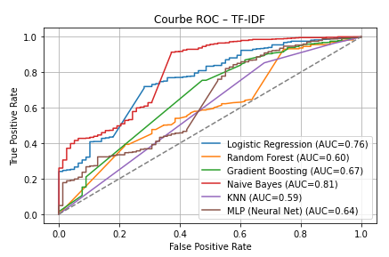

> *Figure: ROC curves for the TF-IDF models. Although Naive Bayes achieves the highest AUC (0.807), this is misleading: its predictions are heavily biased toward class 1. The ROC curve appears good only because the model confidently classifies all samples as positive, not because it separates classes effectively.*

---

#### Confusion Matrices

#####  Naive Bayes (TF-IDF)

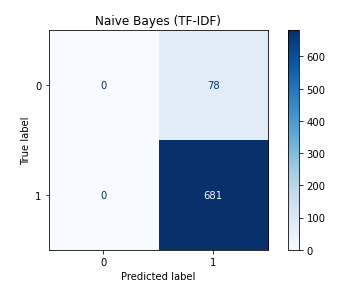

> The confusion matrix reveals a critical flaw: **Naive Bayes never predicts class 0**. Despite achieving high accuracy and AUC, it fails entirely to detect negative examples, leading to a **F1-score of 0 for class 0**. This highlights a serious **bias toward the majority class**, which makes the model unreliable in practice if detecting bad restaurants is essential.

#####  Random Forest (TF-IDF)

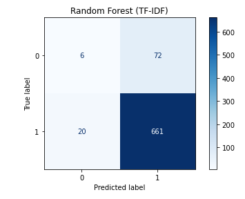

> Random Forest does predict both classes, including some **true negatives**. However, it suffers from a high number of **false positives**, reducing its precision and lowering the F1-score for class 0 to **0.116**. Still, it performs better than Naive Bayes in terms of class balance, even if its overall discriminative power is limited on sparse vectors.

---

###  Summary – TF-IDF Evaluation

TF-IDF turned out to be the most balanced vectorization method, offering a good compromise between performance and interpretability. Among the models tested:

- **LinearSVC** provided the best balance, with the **highest F1_macro** and the **best recall on class 0**, making it the most reliable model for identifying poorly rated restaurants.
- **Logistic Regression** was solid but less effective at capturing complex patterns.
- **Naive Bayes**, although achieving the **highest accuracy and AUC**, failed completely at classifying negative instances, rendering it unusable for critical filtering.
- **Tree-based models** (Random Forest, Gradient Boosting) handled the data reasonably but struggled with sparse input representations.
- **MLP and KNN** showed weaker class 0 performance, despite high overall accuracy.

This evaluation highlights the importance of going beyond accuracy and AUC when the goal is **class balance and fairness**, especially in imbalanced settings like ours. F1-scores per class and confusion matrices provide crucial insights into model behavior and suitability for real-world applications.

### Conclusion – TF-IDF Performance

TF-IDF vectorization consistently enabled strong classification performance, especially for linear models like **Linear SVC** and **Logistic Regression**. These models effectively leveraged the sparse, high-dimensional nature of TF-IDF to capture relevant patterns.

However, while **Naive Bayes** showed a high AUC, it failed completely on minority class detection — illustrating the limits of probabilistic independence assumptions under sparse, imbalanced conditions.

In summary, **TF-IDF + Linear SVC** stands out as the **best compromise** between accuracy, fairness across classes, and computational efficiency — making it the most reliable setup for this task.

### 2.5.2 Results and Model Comparison (with Bag of Words)

This section presents the performance of different classifiers using the **Bag of Words (BoW)** vectorization. Although more simplistic than TF-IDF, BoW surprisingly performs well in some settings — especially with Naive Bayes.

####  Global Results (BoW)

| Model                | Accuracy | F1_class_0 | F1_macro | AUC     |
|----------------------|----------|------------|----------|---------|
| **Naive Bayes**      | **0.910**| **0.393**  | **0.672**| **0.842** |
| Logistic Regression  | 0.788    | 0.353      | 0.613    | 0.767   |
| Linear SVC           | 0.806    | 0.329      | 0.608    | —       |
| MLP (Neural Net)     | 0.871    | 0.210      | 0.570    | 0.654   |
| Random Forest        | 0.868    | 0.074      | 0.501    | 0.651   |
| Gradient Boosting    | 0.893    | 0.024      | 0.483    | 0.671   |
| KNN                  | 0.892    | 0.000      | 0.471    | 0.532   |

> *Table: Classification results with BoW vectors. Naive Bayes outperforms all other models across accuracy, F1 scores, and AUC, particularly for the minority class.*

---

#### ROC Curve – BoW

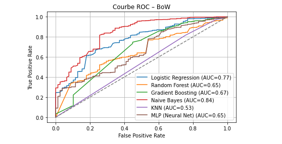

> *Figure: ROC comparison for BoW models. Naive Bayes shows the strongest class separation (AUC = 0.84), followed by Logistic Regression. The curve reflects reliable binary discrimination, making it suitable for quality-sensitive applications.*

---

#### Confusion Matrices

#####  Naive Bayes (BoW)

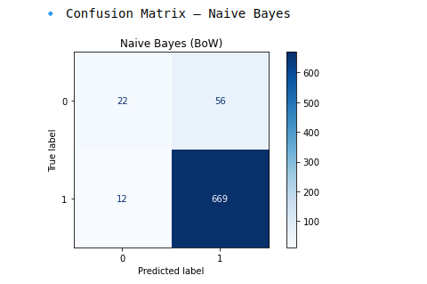

> In contrast to its TF-IDF counterpart, **Naive Bayes with BoW successfully identifies class 0**, correctly classifying 22 out of 78 poorly-rated restaurants. It maintains a good balance with the majority class, contributing to its strong F1_macro score.

#####  Random Forest (BoW)

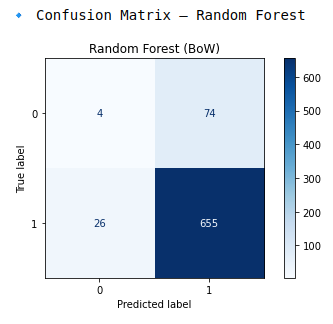

> **Random Forest fails to detect class 0**, misclassifying nearly all negative samples. Despite a high overall accuracy, it shows a strong **prediction bias** and records one of the **lowest F1_class_0 (0.074)** scores among all models.

---

###  Summary – BoW Results

- **Naive Bayes** delivers the **highest overall performance**:  
  - Accuracy = **91%**  
  - F1_class_0 = **0.393**  
  - AUC = **0.84**  
  This result confirms the effectiveness of probabilistic models when aligned with the assumptions of BoW representations.

- **Logistic Regression** offers a solid middle ground, showing high AUC and a competitive F1 score, making it a reliable yet interpretable choice.

- **Linear SVC** performs reasonably well but does not outperform its results with TF-IDF.

- **Complex models** like MLP, Random Forest, and Gradient Boosting fail to make meaningful predictions for the minority class, despite good overall accuracy. This indicates that BoW lacks the expressiveness needed for more nuanced models to learn effectively.

###  Conclusion – BoW Performance

In summary, **Naive Bayes + BoW** is the **best-performing combination** in this setting. Its statistical assumptions match BoW perfectly, resulting in strong minority class detection and overall balance.

This highlights that **model success is tightly linked to feature representation**. BoW, while simplistic, works exceptionally well when paired with lightweight probabilistic models. For deeper or non-linear classifiers, more expressive features like TF-IDF or embeddings may be required.

### 2.5.3 Results and Model Comparison (with Word2Vec)

This section presents the performance of various models using **Word2Vec** embeddings. Each restaurant is represented by the average of its keyword vectors learned in context. While theoretically more semantically expressive, the practical results are mixed.

####  Global Results (Word2Vec)

| Model                | Accuracy | F1_class_0 | F1_macro | AUC     |
|----------------------|----------|------------|----------|---------|
| Linear SVC           | 0.585    | 0.245      | 0.479    | —       |
| Logistic Regression  | 0.594    | 0.238      | 0.481    | 0.607   |
| KNN                  | 0.892    | 0.089      | 0.516    | 0.563   |
| Gradient Boosting    | 0.899    | 0.072      | 0.509    | 0.657   |
| MLP (Neural Net)     | 0.899    | 0.025      | 0.486    | 0.663   |
| Random Forest        | 0.897    | 0.000      | 0.473    | 0.646   |

> *Table: Model performances using Word2Vec embeddings. Although accuracy is high, minority class detection remains a major weakness.*

---

#### ROC Curve – Word2Vec

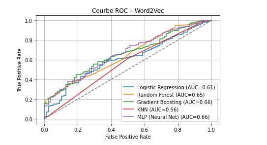

> *Figure: ROC curves for Word2Vec models. While MLP and Gradient Boosting achieve the highest AUC (~0.66), the separation remains modest and does not translate into class 0 recall.*

---

#### Confusion Matrices

#####  Gradient Boosting (Word2Vec)

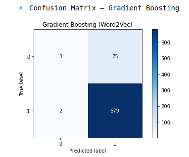

> Gradient Boosting manages to identify a few negative samples (3 correct class 0 predictions), but overall remains **heavily biased toward the positive class**.

#####  MLP (Neural Net)

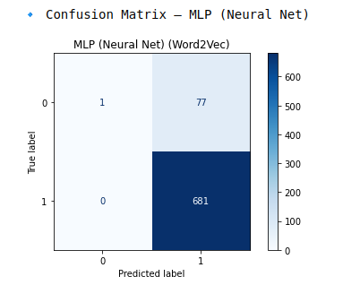

> Despite an AUC of 0.663, the neural network **fails to classify almost any class 0 samples**, predicting them only once. This explains its extremely low F1_class_0 score (0.025).

---

###  Summary – Word2Vec Model Behavior

Several key findings emerge from the Word2Vec results:

- **Linear models** (SVC, Logistic Regression) reach modest scores (accuracy ~0.59), but with relatively **acceptable F1_class_0 (~0.24)** — better than complex models on that front.

- **Complex models** (MLP, Gradient Boosting, Random Forest) show **strong bias toward class 1**, leading to poor sensitivity on class 0. They produce high accuracy and AUC, but fail where it matters for fair recommendations.

- **MLP** demonstrates this trade-off clearly: despite having the best AUC, it essentially ignores the minority class in prediction.

- Overall, **Word2Vec embeddings are not effectively leveraged** here due to the short, fixed-format nature of the input texts (`keywords`), which limits contextual richness.

---

###  Conclusion – Word2Vec Performance

Although Word2Vec is known for its semantic depth, it did **not outperform simpler vectorization methods** in our scenario. This is likely due to the **short and categorical nature of the input texts**, which lack the contextual richness needed for Word2Vec to shine.

Models trained on Word2Vec representations tended to **overfit the majority class**, resulting in **poor recall and F1 scores for negative (class 0) cases**, making them less suitable for applications like quality filtering or alerting.

In short, while Word2Vec provided **high accuracy and some AUC gains**, its inability to balance both classes limits its utility. Traditional methods like **TF-IDF** remain more reliable in this context.

### 2.5.4 Results and Model Comparison (with Doc2Vec)

In this section, we evaluate the performance of models trained using **Doc2Vec** embeddings. Unlike Word2Vec, which aggregates word vectors, Doc2Vec learns a unique dense vector for each document (i.e., each restaurant).

####  Global Results (Doc2Vec)

| Model                | Accuracy | F1_class_0 | F1_macro | AUC     |
|----------------------|----------|------------|----------|---------|
| Linear SVC           | 0.635    | 0.277      | 0.516    | —       |
| Logistic Regression  | 0.640    | 0.268      | 0.514    | 0.711   |
| MLP (Neural Net)     | 0.884    | 0.170      | 0.553    | 0.650   |
| KNN                  | 0.890    | 0.162      | 0.552    | 0.572   |
| Gradient Boosting    | 0.895    | 0.070      | 0.506    | 0.643   |
| Random Forest        | 0.897    | 0.000      | 0.473    | 0.653   |

> *Table: Results of classifiers using Doc2Vec embeddings. Despite high accuracy, performance on the minority class remains poor overall.*

---

#### ROC Curve – Doc2Vec

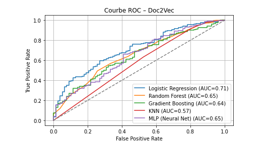

> *Figure: ROC curves for Doc2Vec-based models. Logistic Regression reaches the best AUC (0.71), followed by MLP and Gradient Boosting.*

---

#### Confusion Matrices

#####  Logistic Regression (Doc2Vec)

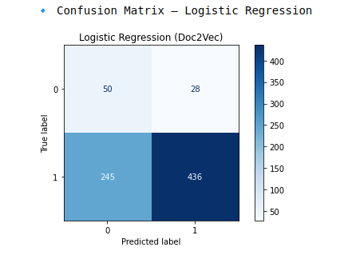

> Logistic Regression manages a decent class balance. It correctly predicts **50 out of 78 class 0** cases, missing the rest (245 false negatives).

#####  KNN (Doc2Vec)

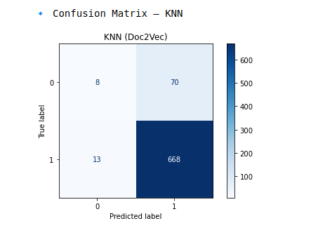

> While KNN yields a strong overall accuracy, it shows **strong bias toward class 1**. It correctly predicts only **8 out of 78** negative cases.

---

###  Summary – Doc2Vec Model Behavior

While **Doc2Vec** aims to capture holistic meaning by assigning each document a learned embedding, this strength is not fully leveraged here due to the **short and formulaic nature of the input (`keywords`)**.

- **Linear models** (SVC, Logistic Regression) remain relatively stable. Logistic Regression performs best here, with an **AUC of 0.71** and a **F1_class_0 of 0.27**, but still does not surpass TF-IDF.

- **Non-linear models** such as **MLP and KNN** achieve **high accuracy (~0.89)** but exhibit **low recall for class 0**, similar to what was observed with Word2Vec.

- **Tree-based models** (Random Forest, Gradient Boosting) struggle significantly: despite reasonable AUC (~0.65), they **fail to detect class 0 almost entirely**.

> The best combination appears to be **Doc2Vec + Logistic Regression**, though it remains weaker than TF-IDF overall, especially in detecting negative reviews.

---

###  Conclusion – Doc2Vec Performance

Despite its theoretical appeal, **Doc2Vec proves too sophisticated for our short and categorical `keywords` dataset**. Its advantages are best realized in longer, semantically rich texts — conditions not met here.

Just like with Word2Vec, the models trained on Doc2Vec embeddings are **heavily biased toward the majority class**, offering **poor detection of class 0**. In recommendation contexts where balanced performance is essential, this is a critical flaw.

Combined with its **high training cost** and **marginal gains**, these results confirm our earlier conclusion: **TF-IDF remains the most effective and reliable vectorization strategy** in this project.

###  General Conclusion – Model and Vectorization Comparison

The combined analysis of results across all vectorization methods (TF-IDF, BoW, Word2Vec, Doc2Vec) and classification models reveals several concrete insights.

---

####  Overall Performance

The best trade-offs between global accuracy and the ability to correctly identify **poorly rated restaurants** (F1_class_0) were achieved with:

- **TF-IDF + Linear SVC**: F1_class_0 = 0.37, F1_macro = 0.637  
- **BoW + Naive Bayes**: F1_class_0 = 0.392, F1_macro = 0.672, AUC = 0.84  
- **TF-IDF + Logistic Regression**: F1_class_0 = 0.329, F1_macro = 0.606  

The **highest AUC scores** (Area Under the ROC Curve) were observed with **BoW + Naive Bayes** and **TF-IDF + Logistic Regression**, indicating strong probabilistic class separation capability.

####  Why are some AUC values `NaN`?

AUC values are missing (`NaN`) for models such as **Linear SVC** because they do not implement the `predict_proba()` method in their scikit-learn implementation. This method is essential to compute AUC, as it provides **probability estimates** per class. Without it, only binary predictions (`predict()`) are available, preventing ROC curve generation and thus AUC calculation.

Therefore, **Linear SVC**, despite strong accuracy and F1 scores, does not provide an AUC score in this context.

####  Vectorization Method Comparison

- **TF-IDF** stands out as the most **reliable, stable, and effective** method, especially with linear models. It combines strong overall accuracy with better sensitivity to the minority class.
  
- **BoW**, though simple, performs exceptionally well with **Naive Bayes**, showing that well-matched simple methods can outperform more complex approaches under the right conditions.

- **Word2Vec** and **Doc2Vec** achieved decent accuracy but **consistently underperformed on F1_class_0**, highlighting their limitations in predicting poorly rated restaurants. Additionally, both methods involve **significantly higher computational cost**.

---

###  Final Takeaways

Overall, the best-performing setup for our use case is **TF-IDF + Linear SVC**, which offers:

- Strong performance on the minority class (F1_class_0)  
- Fast training and inference  
- Moderate interpretability  
- Good generalization to unseen data  

Dense vectorization methods (Word2Vec, Doc2Vec), although theoretically appealing, are **ill-suited to short, structured text fields like our `keywords`**. Their computational cost outweighs their practical benefit in this context.

Finally, using **multiple evaluation metrics** (accuracy, F1_class_0, AUC) provided a balanced view of model quality. This was particularly important given our class imbalance, where **detecting poorly rated restaurants**—though challenging—is the most critical task for a recommender system.

## 3. Task 3 – Interactive Dashboards (LDA, Classification, Recommendation)

The final phase of the project aimed to make our results easily accessible and interpretable through **interactive dashboards**. These dashboards allow users to explore both the **topic modeling results** and the **performance of the classification models**, as well as **dynamic restaurant recommendations**. All dashboards were implemented using **Dash (Plotly)** in Python.

To accelerate development and ensure a clean structure, we used **ChatGPT as a co-pilot** to assist in writing and debugging the Dash code logic. This helped us save time and focus more on functionality and usability.

###  3.1 LDA Topic Explorer

The first dashboard provides a **visual exploration of the LDA topic model** built on restaurant keywords.

**Main features:**
- **Topic filter**: Select a topic to see associated restaurants on the map.
- **City filter**: Zoom into a specific city.
- **Bar chart**: Distribution of topics across all restaurants.
- **Map view**: Restaurants colored by topic using Mapbox.
- **Keyword display**: The top 10 most representative keywords for each topic are shown interactively.

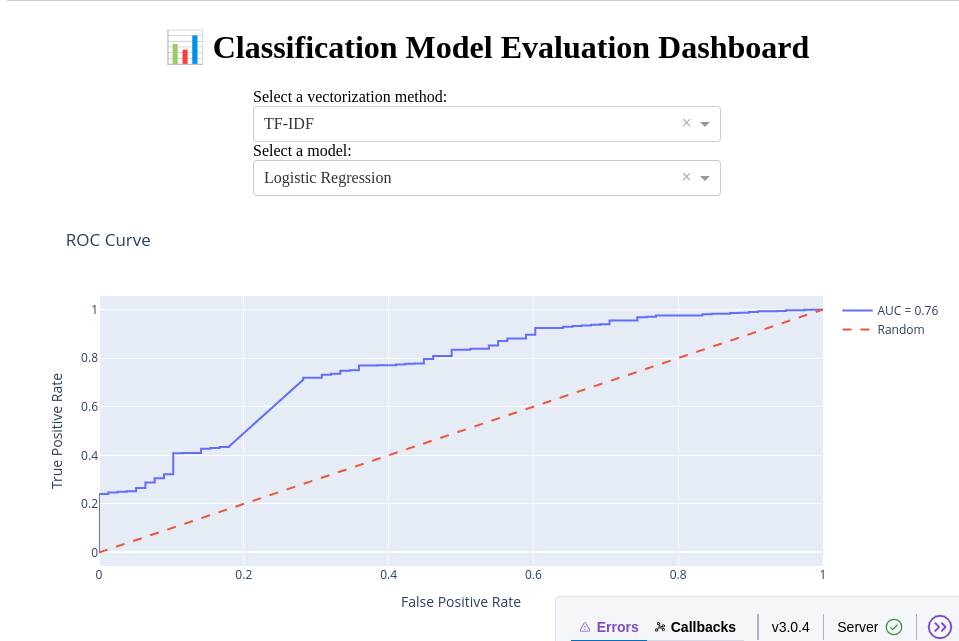
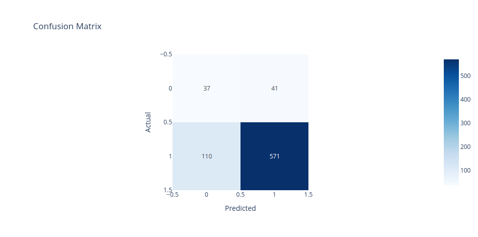
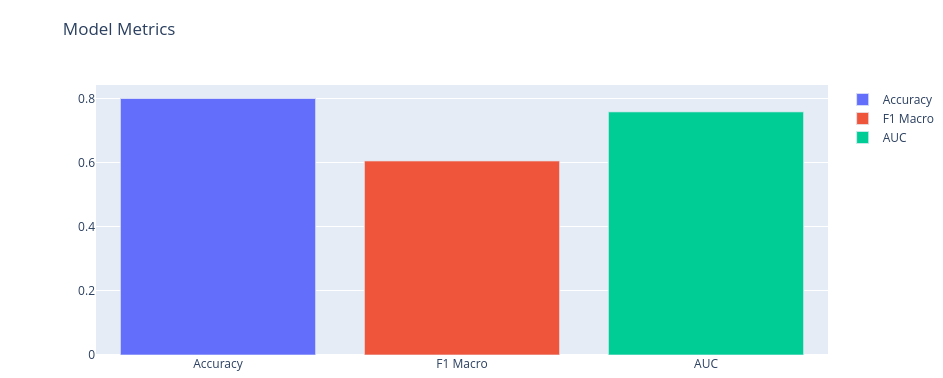

 This dashboard gives users a sense of **semantic clustering** and how different types of restaurants (e.g., romantic, healthy, family-friendly) are geographically distributed across France.

###  3.2 Classification Model Evaluation

The second dashboard compares the **supervised models** trained to predict whether a restaurant is well-rated based on its textual descriptors.

**Main features:**
- **Vectorization and model selector**: Choose among all vector-method and classifier combinations.
- **ROC Curve**: See the model’s ability to distinguish between good and bad restaurants.
- **Confusion Matrix**: Understand how many restaurants were correctly classified.
- **Metric bar chart**: Compare Accuracy, F1-Macro, and AUC side-by-side.

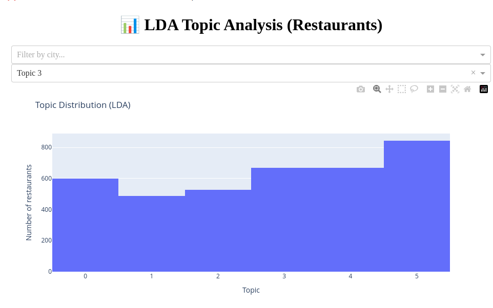
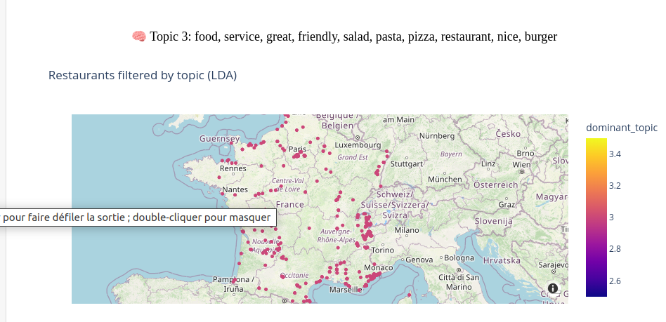

 This dashboard is ideal for **model comparison and performance diagnostics**. It shows how different algorithms behave depending on the feature space (TF-IDF, BoW, Word2Vec, etc.).

###  3.3 Restaurant Recommender (Based on Model Predictions)

The final dashboard turns predictions into an **actionable recommender system**.

**Main features:**
- **Dynamic filtering**: Choose a vectorization method and classifier.
- **Map view**: Display only positively predicted restaurants (`target_pred == 1`) with color-coded scores.
- **Top 10 table**: Highlight the highest scoring restaurant recommendations.
- **Bottom 10 table**: List the least recommended places, helping to interpret errors or low scores.

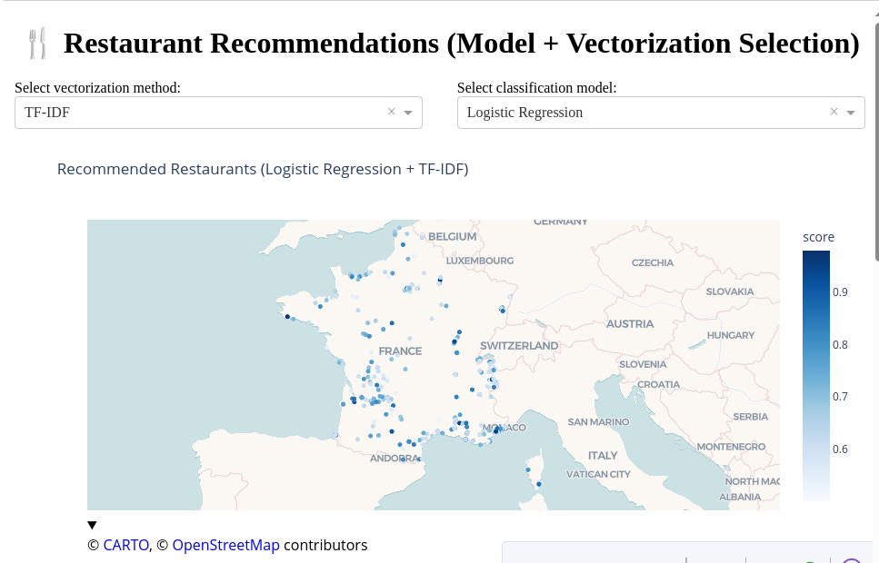
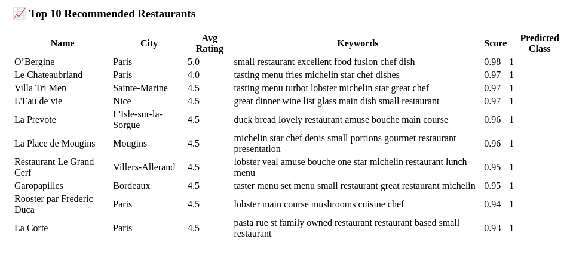
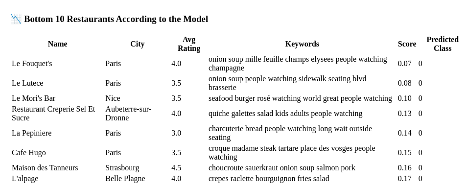

 This system mimics a **real-world application** where an end-user might explore top-rated options in a given region, powered by machine learning.

## Final Conclusion

This project enabled us to implement a complete pipeline for the automated analysis of textual data — from preprocessing to interactive visualization. Starting from a dataset extracted from TripAdvisor, we focused our analysis on restaurants located in France. Using keyword-based descriptors that characterize each establishment, we aimed to extract meaningful thematic patterns and predict the perceived quality of restaurants based on their average ratings.

The first stage involved cleaning, structuring, and transforming textual data through various vectorization techniques: TF-IDF, Bag of Words (BoW), Word2Vec, and Doc2Vec. We found that simpler methods like TF-IDF, when well-suited to the data type (in this case, short and structured keywords), remain particularly effective. In particular, the combination of TF-IDF and a LinearSVC classifier proved to be the most robust and accurate in predicting well-rated establishments, achieving a strong F1-score on the minority class.

In parallel, we used unsupervised techniques such as **Latent Dirichlet Allocation (LDA)** to uncover latent topics in the corpus. This algorithm successfully identified distinct restaurant categories (e.g., family-friendly, gourmet, vegetarian, bar/lounge) based on dominant keyword patterns. The optimal number of topics was selected through both a **coherence score curve (`c_v`)** and qualitative interpretation — the latter supported by **ChatGPT**, which helped us strike a balance between interpretability and thematic richness.

Finally, to make the results accessible to a non-technical audience, we developed **three interactive dashboards** using Dash. The first allows users to geographically explore LDA topics via a map and city filters. The second serves as a visual classification evaluator, letting users compare models and view confusion matrices, ROC curves, and metric summaries. The third dashboard acts as a recommendation engine, where users can test various model/vectorization pairs and view top or bottom recommended restaurants based on prediction scores.

This project was a valuable opportunity to apply key tools in **natural language processing and supervised learning** in a real-world context. It shows that even a relatively simple dataset  such as keyword-based restaurant profiles  can yield rich analyses, high-performing models, and smart interfaces. More broadly, it highlights the value of combining **technical rigor, interactive visualization**, and **interpretation support** to transform textual data into a **practical decision-making tool**.
